In this post, I’m going to talk about the project I’ve been working on for the past two years: building a CTF hosting platform.

## How all started?

Between 2022 and 2024, I was creating challenges for Hackthebox, and, well… the wait time for a response from Hackthebox is over a year, and then they reply with just a couple of lines saying they don’t think the challenge is suitable for Hackthebox, which is pretty frustrating.


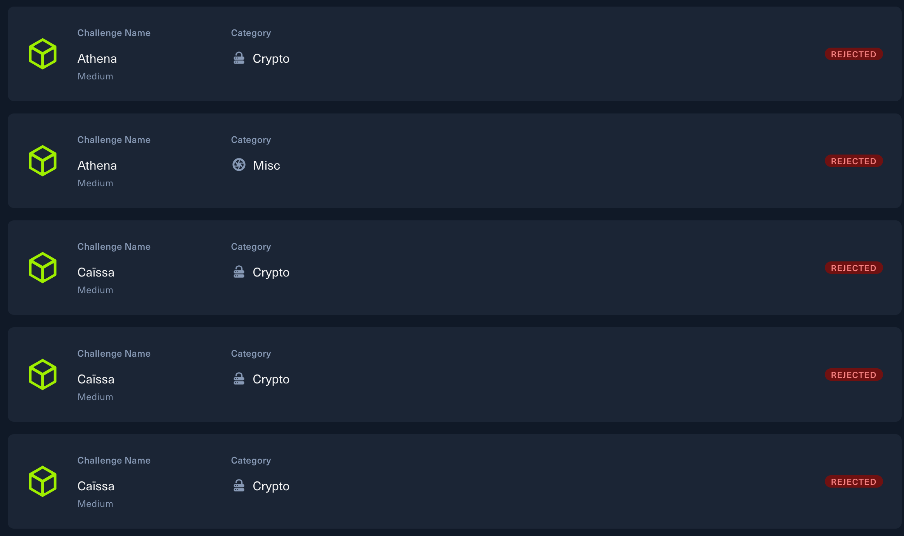
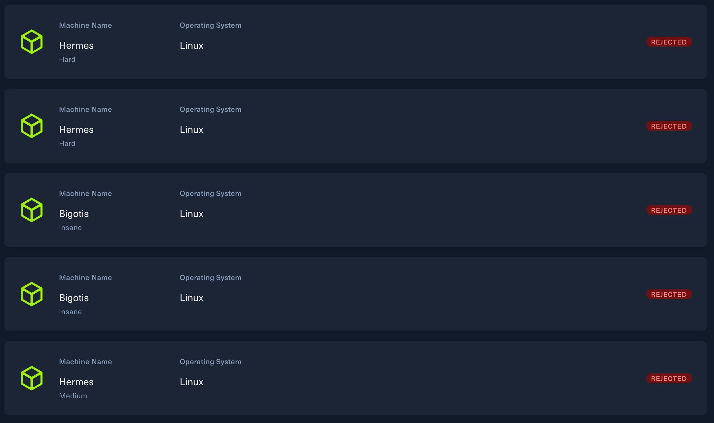


So I created a simple PHP website to upload the challenges so my friends could view and solve them. At first, there were only two challenges, no input to submit flags, no login, nothing! Just a button to download the challenges. It was too basic, so I created a system for submitting solutions and a leaderboard so my friends could compete against each other.

Adding features to a website to improve its appearance is very addictive, so the site began to evolve with new features and styles, such as a trophy system, animated backgrounds, and so on.


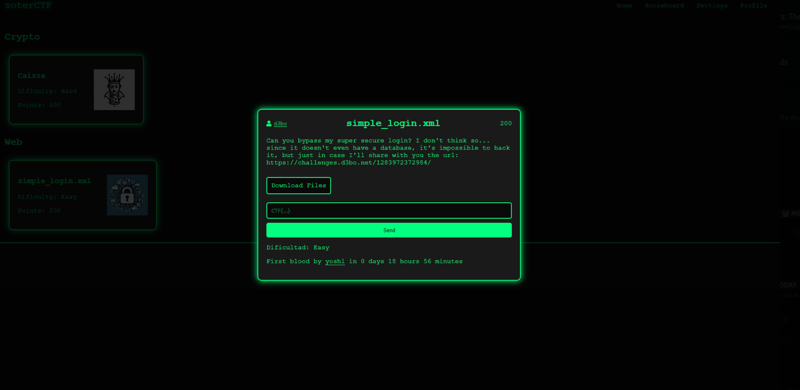
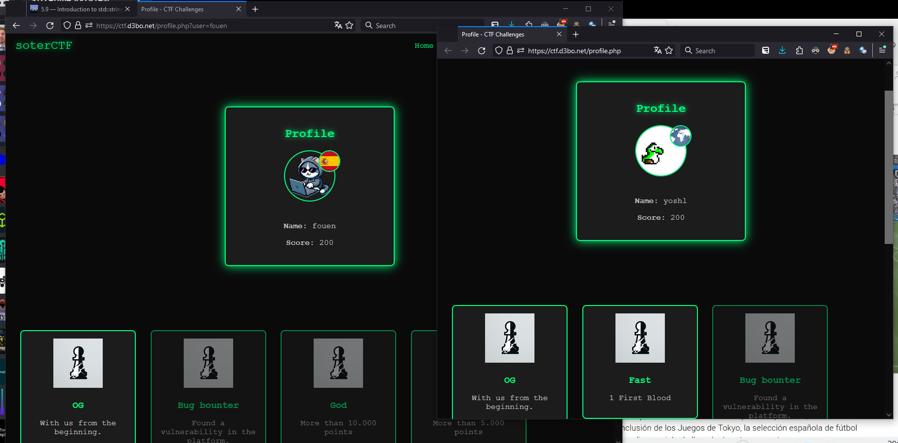
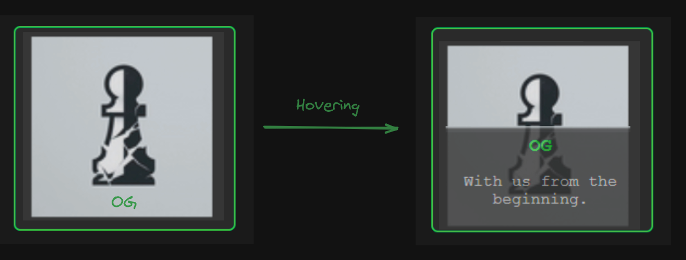
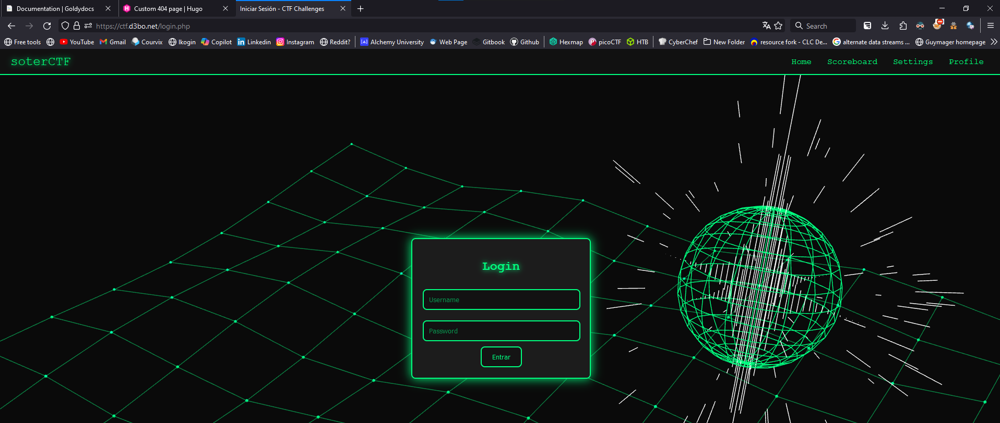



## Soter v2

The website had become a mess full of duplicate code, poorly structured code, and it looked terrible because when I started, I didn't know much about web development, so I decided to start from scratch, better organizing the site's files and giving it a more appropriate structure.

### Design

Things started to get serious, so I called my friend [mele.mdp](https://www.instagram.com/mele.mdp/) to design the logo and color palette for the website. While we were discussing the project, we were playing a few games of Brawlhalla, specifically, I was playing as the character *mako*, who is a kind of shark, and his skin was so cool that we used it as inspiration for the logo.


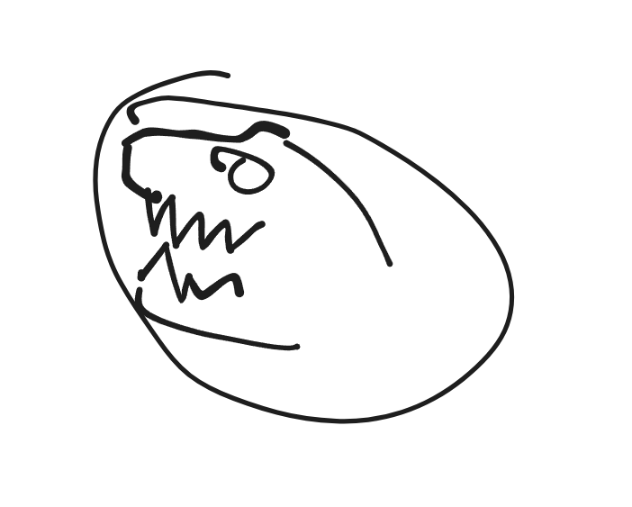
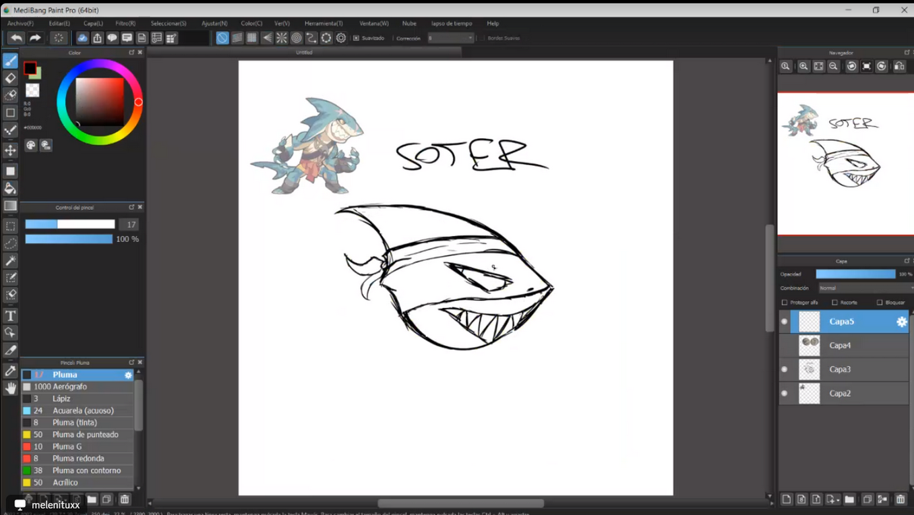
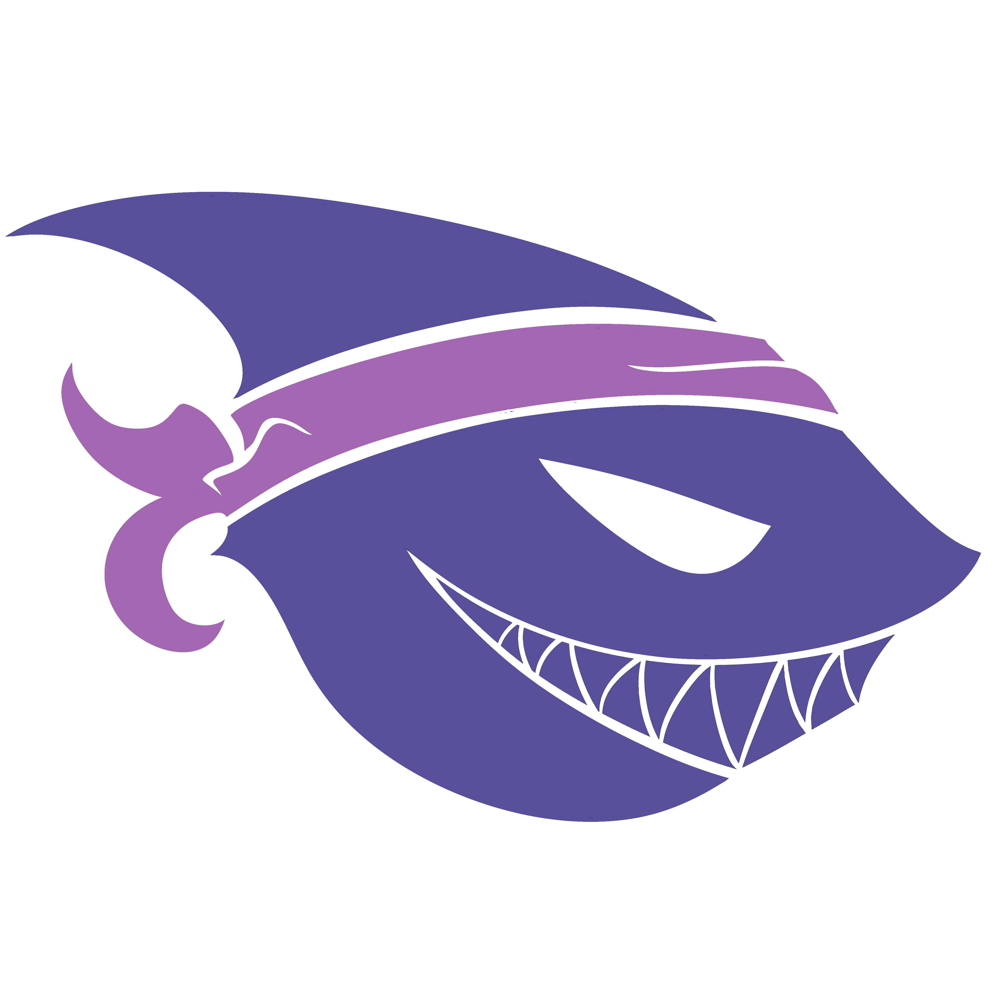


[mele.mdp](https://www.instagram.com/mele.mdp/) has also created new trophies for “First Blood,” “Top 3,” “100% Platform Completion,” etc. The ones from the other version were created using AI, and I'm not a big fan of AI generated images. 

Creating trophies is very important because it fosters a competitive spirit among players, making them want to solve more challenges and improve in order to earn new trophies.





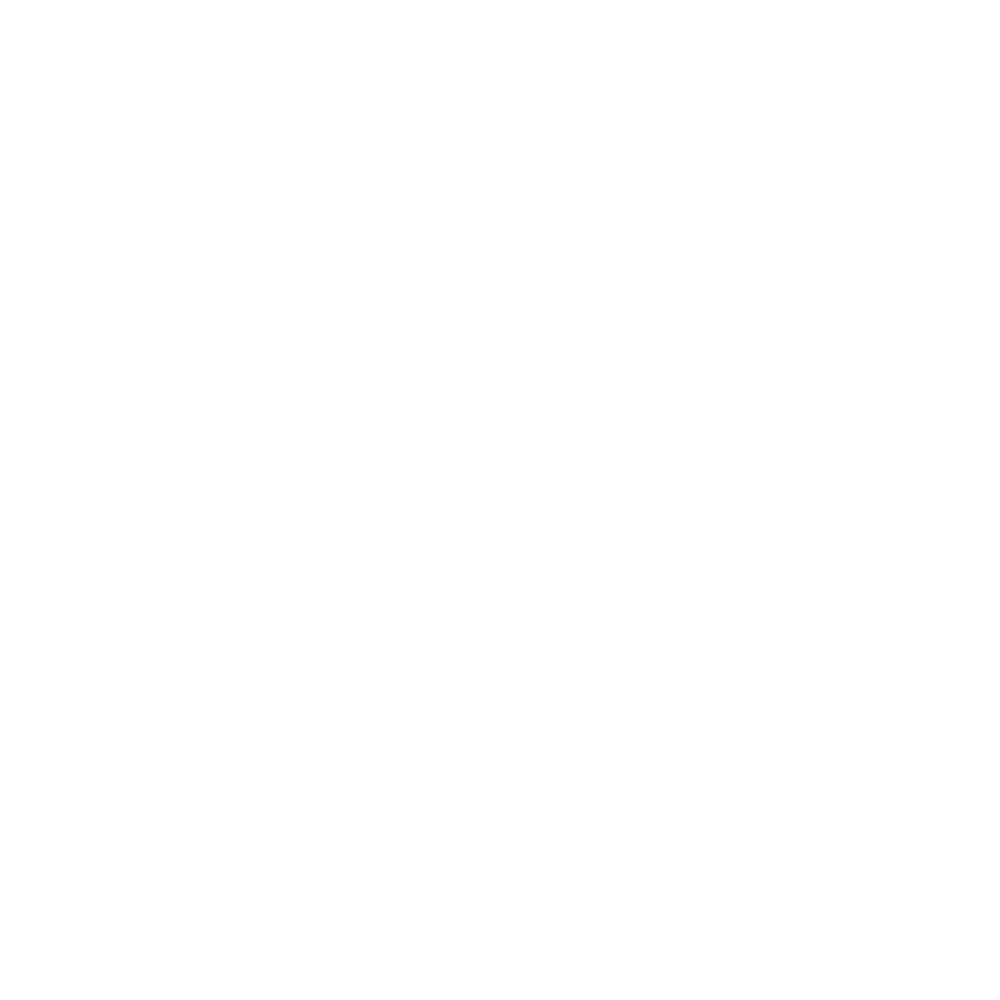
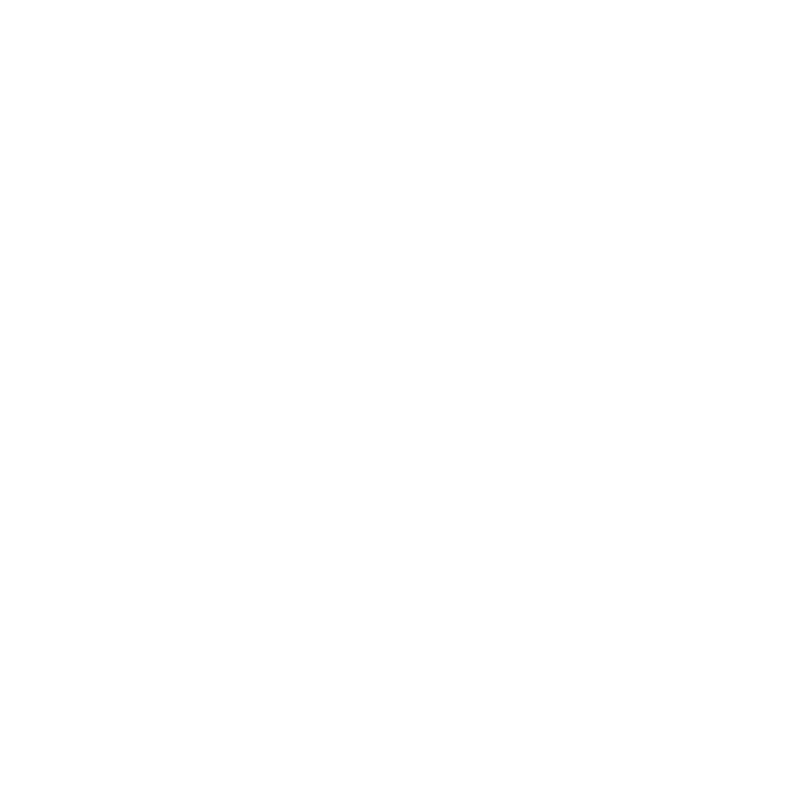
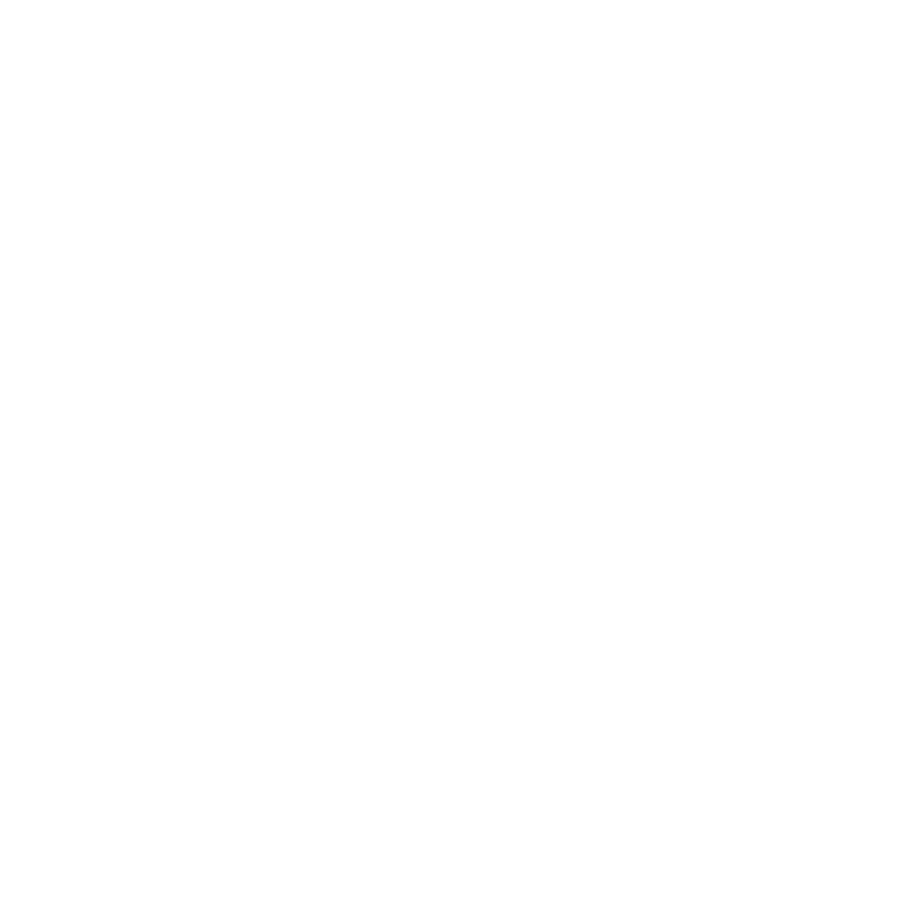

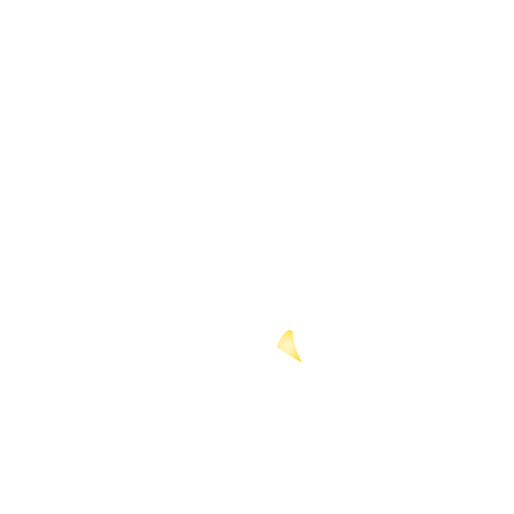
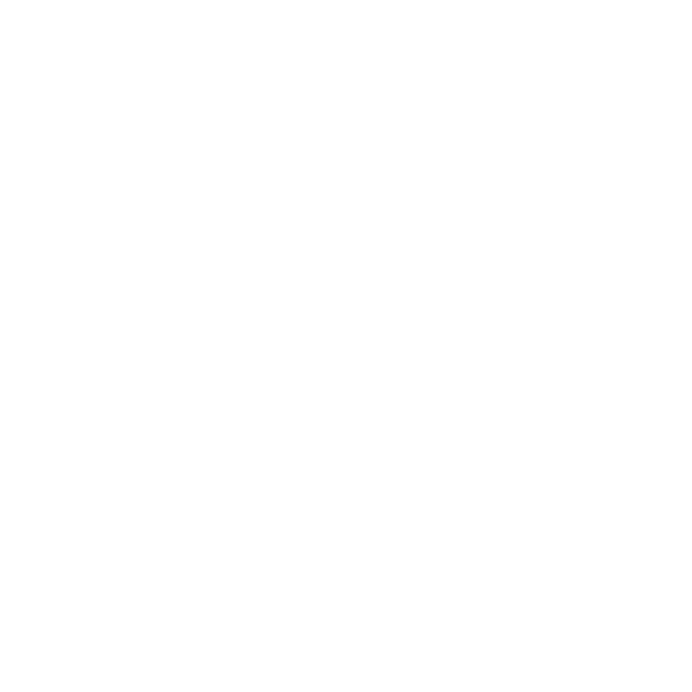


### Hosting

The next step was to switch my hosting from a cdmon plan—which only offered FTP and a website with no control over the server—to a VPS on Hostinger.

On the VPS, I only installed MySQL and Apache, without Docker, because I didn’t need it at the time and wasn’t familiar with it yet. Also, there was no version control system like Git for the website, I would simply upload a ZIP file with the code every time I wanted to update it, and unzip it into the website folder. That ended up causing several problems when I wanted to roll back updates, and it also caused my local files and the server files to get out of sync. CHAOS. But it worked :)

### Website


The website was built using HTML, CSS, PHP, and JavaScript,no frameworks or Bootstrap, just plain code, and each API endpoint had a single SQL query, which made the site very fast but also made it difficult to scale and maintain. Since it was impossible to get a quick overview of who could access each endpoint, whether the endpoint required authentication, Here’s an example of an endpoint 

```php
$query = "
SELECT
    u.id AS user_id,
    u.user AS username,
    u.country,
    u.profile_picture,
    u.email,
    u.public,
    u.description,                
    COALESCE(SUM(ch.points), 0) AS total_score,

    (
        SELECT GROUP_CONCAT(role SEPARATOR ',')
        FROM user_role ur
        WHERE ur.user_id = u.id
    ) AS roles,

    (
        SELECT GROUP_CONCAT(CONCAT(t.image,'|',t.name) SEPARATOR '##')
        FROM trophies_owned tro
        INNER JOIN trophies t ON tro.trophy_id = t.id
        WHERE tro.user_id = u.id
    ) AS trophies_data,

    (
        SELECT COUNT(*) FROM trophies
    ) AS total_trophies,

    (
        SELECT GROUP_CONCAT(DISTINCT c.image SEPARATOR ',')
        FROM owned_certifications oc
        INNER JOIN certifications c ON oc.cert_id = c.id
        WHERE oc.user_id = u.id
    ) AS cert_images,

    (
        SELECT COUNT(*) FROM challenges
    ) AS total_challenges,

    (
        SELECT COUNT(*)
        FROM completed_challenges cch
        WHERE cch.user_id = u.id
    ) AS completed_challenges,

    (
        SELECT COUNT(*)
        FROM followers f
        WHERE f.follow_id = u.id
    ) AS followers_count,

    (
        SELECT COUNT(*)
        FROM completed_challenges cc1
        WHERE cc1.user_id = u.id
          AND cc1.completion_date = (
              SELECT MIN(cc2.completion_date)
              FROM completed_challenges cc2
              WHERE cc2.challenge_id = cc1.challenge_id
          )
    ) AS first_solves,

    (
      SELECT COUNT(*) + 1
      FROM (
        SELECT u2.id,
               COALESCE(SUM(ch2.points),0) AS sum_points
        FROM users u2
        LEFT JOIN completed_challenges cc2 ON cc2.user_id = u2.id
        LEFT JOIN challenges ch2 ON ch2.id = cc2.challenge_id
        GROUP BY u2.id
        HAVING sum_points > COALESCE(SUM(ch.points),0)
      ) AS sub
    ) AS global_rank

FROM users u
LEFT JOIN completed_challenges cc ON cc.user_id = u.id
LEFT JOIN challenges ch ON ch.id = cc.challenge_id
WHERE u.id = ?
GROUP BY u.id
";
```

On top of that, I started adding some pretty absurd features, for example, one day I watched the movie about how Facebook was created, and I thought, “Why not? Let’s include a social media platform like Twitter in a CTF.” Looking back on it now, I don’t know why I wasted my time on that nonsense


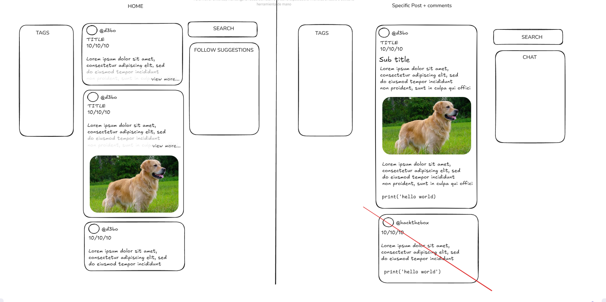
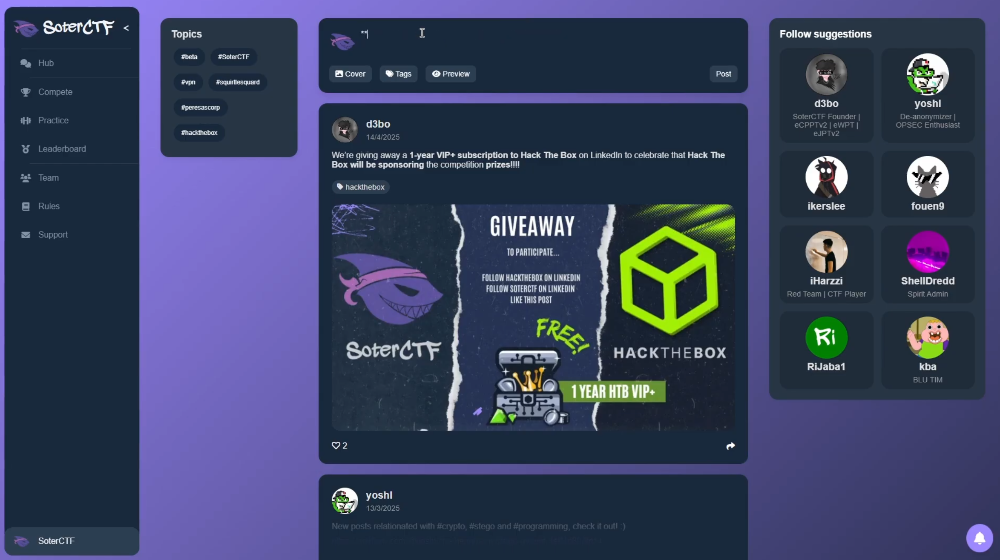
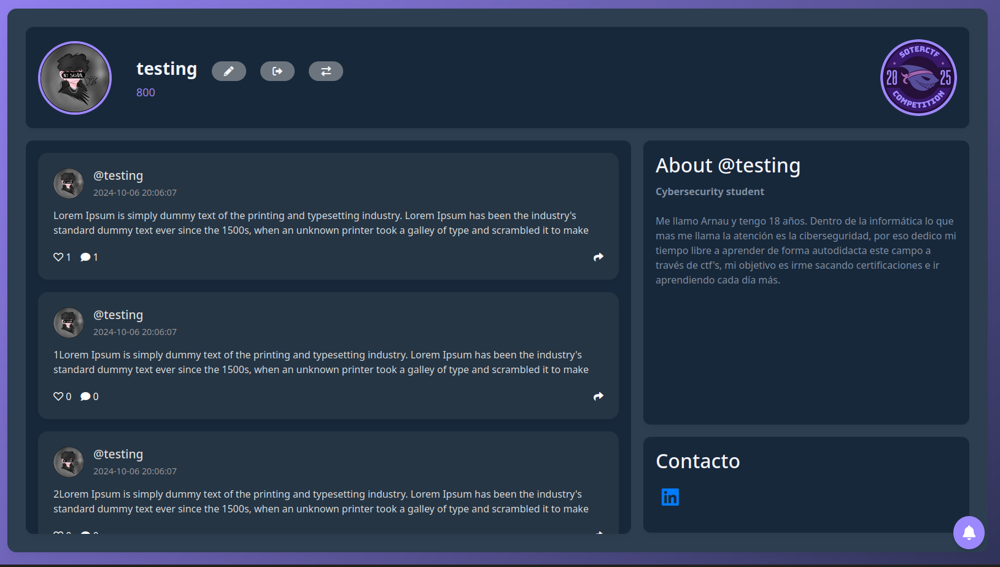


And I built a ticketing system with WebSockets from scratch, because why use Discord when I can have my own chat?


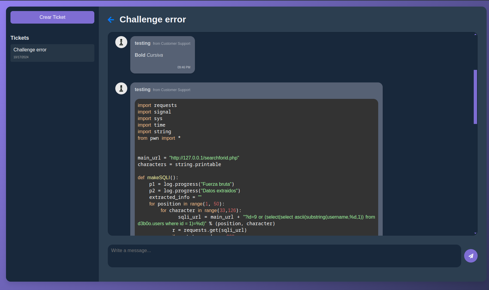
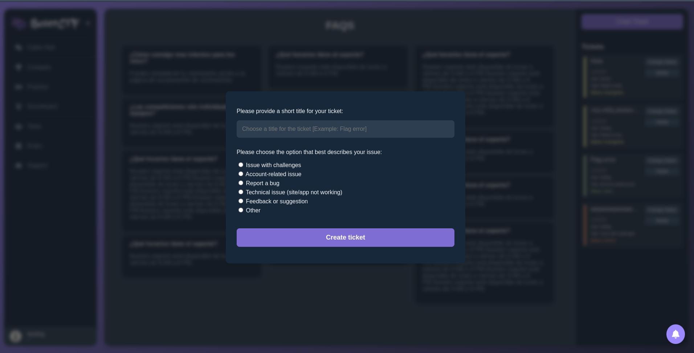
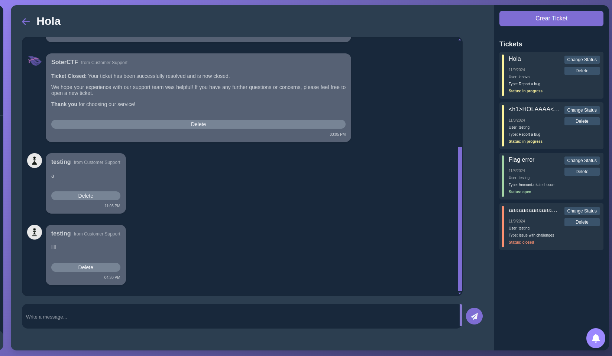



### Searching for sponsor

Once everything was ready, my friends and I started creating challenges, for an upcoming competition, we wanted to do something big, so we prepared about 30 challenges, and ikerslee even created a [trailer](https://youtu.be/9ezMNfPC2h4) to promote both the platform and the competition so we could attract more users.




We also started looking for sponsors by reaching out to many companies in the industry, asking for money or products to offer as prizes in the competition. We attended events with SoterCTF business cards and even went to a startup competition in Barcelona


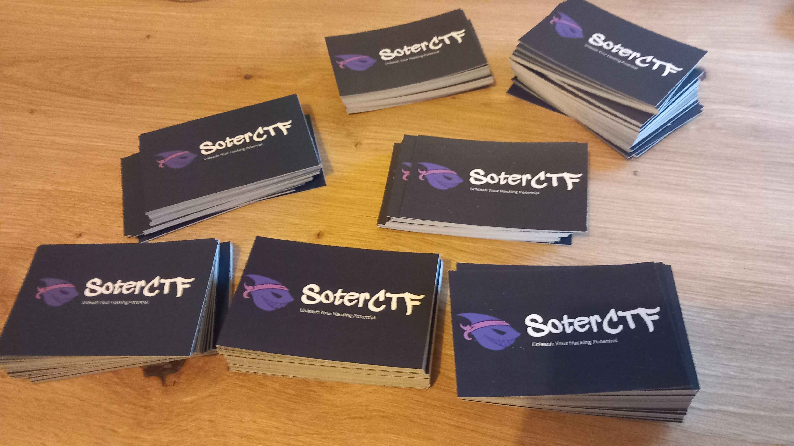
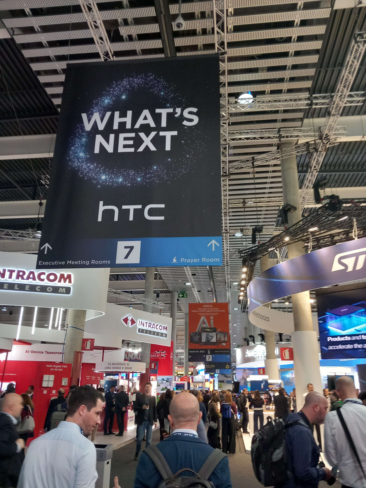
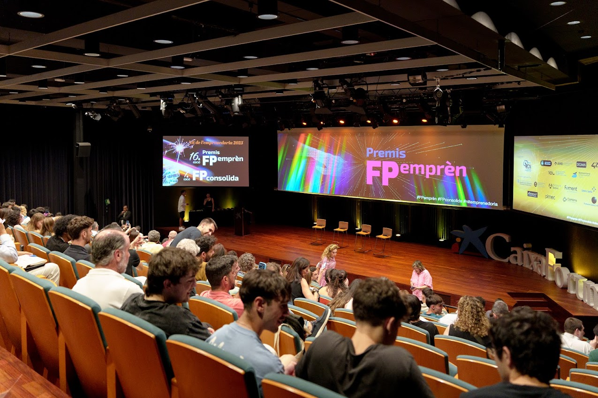
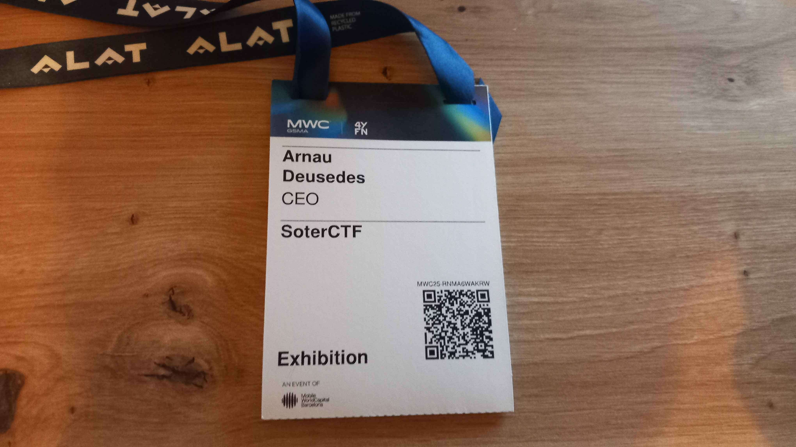
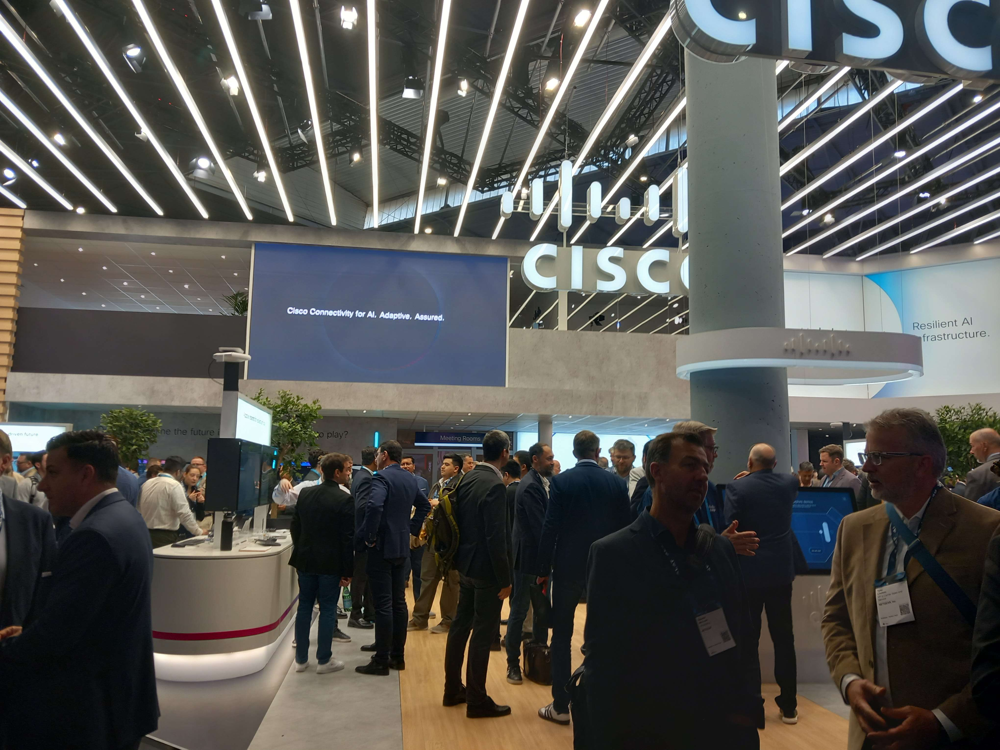


The events didn't go very well, so we started sending emails to leading companies in the industry, such as:

- HackTheBox
- TryHackMe
- INCIBE
- Agencia Catalana de Ciberseguretat
- Binary Ninja
- Pàlcam (Our School)
...

We only managed to get approval from Hackthebox and Pàlcam. But one condition was that the competition had to be listed on CTFtime, and after much insistence, we didn't get a response... That, combined with the fact that the website's poor design made it very difficult to add features, left me burned out, and the project was on hold for a couple of months...

## Final version

In August 2025, exactly one year after starting this project, I decided to delete everything and start from scratch. But before I began coding, I wanted to get everything organized properly, so I spent a week thinking and writing about what this new version would look like, what new features it would offer, what would make it different from the others, how it could be monetized, and so on...

### Database

The first thing I did was design the database. In previous versions, I had been building the database on the fly as I needed tables, which led to a lack of control and chaos, so I grabbed a pen and paper and started drawing the ERD.

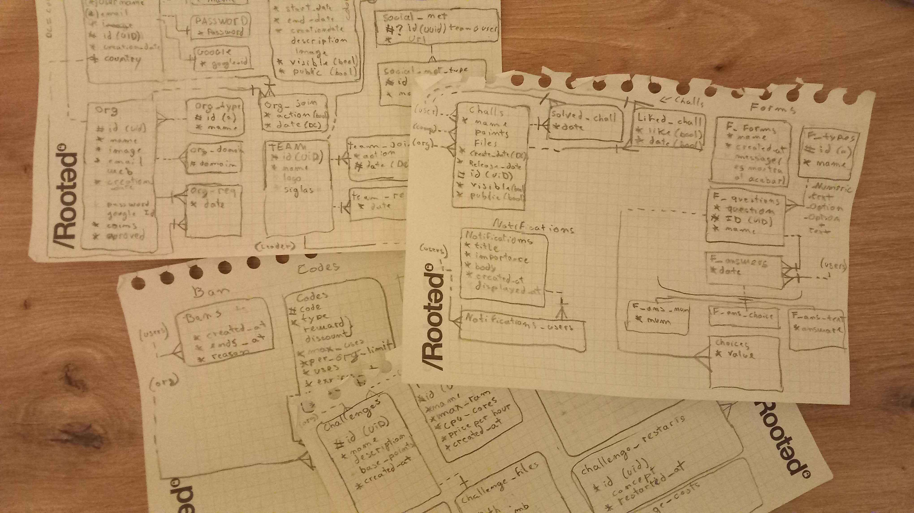

Although it eventually grew to 74 tables with more than 10,000 records

### API

Once I had everything more or less figured out, it was time to code it. So I teamed up with ikerslee to work on it as our final project for our degree.

#### MVC

We chose to build the API using Node.js and following the MVC architecture (or design pattern) in order to create code that is well structured, scalable, and easy to maintain over time.

MVC basically involves dividing the page structure into three main components:

- Model: Manages the data.
- View: Presents the information to the user.
- Controller: Essentially acts as an intermediary.

Each component must be completely independent of the others; if the model is modified, the controller and view must remain unchanged.

We don't use a view, basically, we've created a router, a controller, and a model. For example, a request to view a user's roles would look like this:

```js
userRouter.post('/roles', authRequired(true), hasRole(["admin", "mod"]), userController.addRole);
```

**controller**:

```js
  addRole = async (req, res) => {
    try {
      const parsed = rolesArraySchema.safeParse(req.body);

      if (!parsed.success) {
        const { fieldErrors, formErrors } = parsed.error.flatten();
        return badRequest(res, 'ROLE_VALIDATION_FAILED', {
          fieldErrors,
          formErrors
        });
      }

      const success = await this.userModel.addRole(parsed.data);

      if (!success) {
        return sendResponse(res, {
          status: 404,
          success: false,
          code: 'ROLE_ALREADY_EXISTS_OR_USER_NOT_FOUND'
        });
      }

      return created(res, null, 'ROLE_CREATED');

    } catch (err) {
      console.error(err);
      return serverError(res, 'ROLE_CREATE_ERROR');
    }
  };

```

**model**:

```js
static async addRole(roles) {
    const results = [];

    for (const { role, description } of roles) {
      try {
        await conn.query(
          'INSERT INTO roles (name, description) VALUES (?, ?)',
          [role, description]
        );

        results.push({
          role,
          description,
          created: true
        });

      } catch (err) {
        if (err.code === 'ER_DUP_ENTRY') {
          results.push({
            role,
            description,
            created: false
          });
          continue;
        }
        throw err;
      }
    }

    return results;
  }

```

All API endpoints are documented at [https://docs.soterctf.com](https://docs.soterctf.com).

#### Middlewares

In the previous version, authentication, roles, permissions, and so on were validated with every request. This resulted in a lot of duplicate code and made it difficult to see who had access to each endpoint. In this version, we resolved this issue by creating reusable middleware.

```js
userRouter.post('/roles', authRequired(true), hasRole(["admin", "mod"]), userController.addRole);
                          +----------------+  +-----------------------+
```


The previous request uses two middleware components:

**authRequired**: If set to true, it ensures that the user can only access that endpoint if they are authenticated.

The first thing it does is check if a token is passed and, if that token is valid, it adds the cookie information to `req.user`. This information includes details such as the user’s username, roles, ID, and email. The last thing it does is verify whether the user has been banned.

```js
export const authRequired = (required = true) => {
  return async (req, res, next) => {
    const token = req.cookies?.token;

    if (!token) {
      if (required) {
        return res.status(401).json({ message: "No token provided" });
      } else {
        req.user = null;
        return next();
      }
    }

    let decoded;
    try {
      decoded = jwt.verify(token, process.env.SECRET_KEY);
    } catch (err) {
      if (required) {
        return res.status(401).json({ message: "Invalid token" });
      } else {
        req.user = null;
        return next();
      }
    }

    req.user = decoded;

    try {
      const ban = await AdminBansModel.isUserBanned(decoded.id);
      if (ban) {
        return res.status(403).json({
          success: false,
          code: 'ACCOUNT_BANNED',
          data: {
            reason: ban.reason || null,
            expires_at: ban.expires_at || null,
          },
        });
      }
    } catch (err) {
      console.error('Ban check error in authRequired:', err);
    }

    next();
  };
};

```

**hasRole**: Only users with one of the specified roles can access that endpoint.

```js
export const hasRole = (allowedRoles = []) => {
  return (req, res, next) => {
    const userRoles = req.user?.roles; 

    if (!userRoles || userRoles.length === 0) {
      return res.status(403).json({ message: "Forbidden: Insufficient permissions" });
    }
    const hasPermission = userRoles.some(role => allowedRoles.includes(role));

    if (!hasPermission) {
      return res.status(403).json({ message: "Forbidden: Insufficient permissions" });
    }

    next();
  };
};
```

If the request successfully passes through all the middleware, it is passed to the controller.

Other examples of middleware include:

```js
- rejectEmoji
- allowCompAdmin
- isAdmin
- isChallCreator
- isCompAdmin(['admin', 'creator'])
- isSelfOrHasRole(["admin", "mod", "support"])
- isOwnerOrHasRole(["admin", "mod", "support"])
- canViewSensitiveData(["admin", "mod", "support"])
```

#### Utilities

The controller uses several utilities that reduce code redundancy and improve modularity

**apiResponse**:

```js
return ok(res, { news }, 'NEWS_FETCHED');
```

The apiResponse utility includes several functions that essentially make it easier to send API responses so that they all have the same structure. (There are controller and middleware functions that were created early on and have not yet been implemented, but they will all be included in future updates.)

```js
export const ok = (res, data, code = 'OK') =>
  sendResponse(res, {
    status: 200,
    success: true,
    code,
    data
  });

export const created = (res, data, code = 'CREATED') =>
  sendResponse(res, {
    status: 201,
    success: true,
    code,
    data
  });

export const badRequest = (res, code, data = null) =>
  sendResponse(res, {
    status: 400,
    success: false,
    code,
    data
  });

export const unauthorized = (res, code = 'UNAUTHORIZED') =>
  sendResponse(res, {
    status: 401,
    success: false,
    unauthorized: true,
    code
  });

export const forbidden = (res, code = 'FORBIDDEN') =>
  sendResponse(res, {
    status: 403,
    success: false,
    unauthorized: true,
    code
  });

export const notFound = (res, code = 'NOT_FOUND') =>
  sendResponse(res, {
    status: 404,
    success: false,
    code
  });

export const serverError = (res, code = 'INTERNAL_ERROR') =>
  sendResponse(res, {
    status: 500,
    success: false,
    code
  });
```

**sendTelegramMessage**:

```js
await sendTelegramMessage({
    title: 'New User Registered',
    body: `
        <b>Username:</b> <code>${newUser.username}</code>
        <b>Email:</b> <code>${newUser.email}</code>
        <b>ID:</b> <code>${newUser.id}</code>
        <b>Verified:</b> False
        <b>Timestamp:</b> ${new Date().toLocaleString()}
    `,
    threadId: TELEGRAM_NOTIFICATION_CHAT_ID,
    buttons: [[]]
});
```

This utility makes it easy to send notifications to Telegram

```js
export async function sendTelegramMessage({ title, body, threadId, buttons }) {
  const TELEGRAM_BOT_TOKEN = process.env.TELEGRAM_BOT_TOKEN;
  const TELEGRAM_CHAT_ID = process.env.TELEGRAM_CHAT_ID;

  if (!TELEGRAM_BOT_TOKEN || !TELEGRAM_CHAT_ID) {
    console.error('Missing TELEGRAM_BOT_TOKEN or TELEGRAM_CHAT_ID in .env');
    return;
  }

  const message = `<b>${title}</b>\n\n${body}`;

  const payload = {
    chat_id: TELEGRAM_CHAT_ID,
    text: message,
    parse_mode: 'HTML',
  };

  if (threadId) payload.message_thread_id = Number(threadId);
  
  if (buttons && Array.isArray(buttons)) {
    payload.reply_markup = {
      inline_keyboard: buttons,
    };
  }

  try {
    const url = `https://api.telegram.org/bot${TELEGRAM_BOT_TOKEN}/sendMessage`;

    const res = await fetch(url, {
      method: 'POST',
      headers: { 'Content-Type': 'application/json' },
      body: JSON.stringify(payload),
    });

    if (!res.ok) {
      const errText = await res.text();
      console.error('Error sending Telegram message:', errText);
    }
  } catch (err) {
    console.error('Telegram connection error:', err.message);
  }
}
```

There are many more features like these.

#### Schemas

Another issue I had to deal with in the old version of Soter was data consistency, because it ended up being the case that during signup, a username could be between 5 and 20 characters, but then when editing the profile, it was between 5 and 25, and elsewhere, different values were used. To address this, in the third version we used Zod, which allowed us to define a data schema and even specify error messages, all in an easy and visual way.

```js
import { z } from 'zod';

const baseTeam = z.object({
  name: z.string()
    .min(3, { message: 'The team name must be at least 3 characters long.' })
    .max(20, { message: 'Team name cannot exceed 20 characters' }),

  acronym: z.string()
    .min(2, { message: 'The acronym must be at least 2 characters long.' })
    .max(5, { message: 'Acronym cannot exceed 5 characters' }),
});

export const createTeamSchema = baseTeam;

export const updateTeamSchema = baseTeam.partial();
```

Thanks to this, that type of information can now be validated in a unified and straightforward manner wherever it appears, as shown in the following examples.

```js
createTeam = async (req, res) => {
    const parsed = createTeamSchema.safeParse(req.body);
    ...
}

updateTeam = async (req, res) => {
    const parsed = updateTeamSchema.safeParse(req.body);
    ...
}
```

### Frontend

*I should point out that I'm not a web developer, so I might mess some things up, and frontend development is the area I'm least familiar with*

The tech stack we use React and Tailwind for the design.

One of the key features I wanted in this new version was the ability to customize competitions, since with other companies like Hackthebox or TryHackMe, if you host a CTF there, it will be on the hackthebox.com domain and on their website, with Hackthebox logos everywhere. The idea at Soter was to create a subdomain just for that competition or even use a custom domain, so that page would be 100% in line with the client’s branding and logos, without the player having to access the main soterctf.com page. That meant the subdomain would have its own login, profile, teams, etc... But the beauty of it was also that the user could maintain their progress across multiple CTFs and have their profile show which CTFs they’ve participated in. So the data was going to be the same across all subdomains, meaning that if you create an account on competition1.soterctf.com, you can keep using it on competition2.soterctf.com, and the same goes for teams. But of course, there’s the problem that implementing a login, a profile, and team logic on every subdomain would mean a lot of code duplication. To avoid that, what we did was have the frontend detect which subdomain the user is accessing the site from, and it saves that subdomain as the competition ID and uses it to request the competition name, logos, styling, etc., from the API. This allows for a single website for all subdomains, with only the information and styling changing, thereby avoiding duplicate spaghetti code.

An example makes it easier to understand.

When you go to https://palcamcg2026.soterctf.com, a request is sent to https://api.soterctf.com/api/v3/comp/palcamcg2026 to retrieve information about that competition.

```json
{
  "success": true,
  "unauthorized": false,
  "code": "COMP_FETCHED",
  "data": {
    "comp": {
      "id": "palcamcg2026",
      "name": "Pàlcam CyberGames 2026",
      "logo": "palcamLogo.png",
      "logo_big": null,
      "cover": "cover.webp",
      "org_id": "d935f805-d6ac-11f0-9e02-4a52c5e88dba",
      "is_public": 1,
      "start_at": "2026-04-10T08:00:00.000Z",
      "end_at": "2026-04-11T20:00:00.000Z",
      "max_team_size": 3,
      "theme_name": "scholar",
      "userCanView": true
    },
    "userCompRoles": [
      "admin",
      "challenge_creator"
    ]
  }
}
```

With this, the frontend now knows which title to display, which logos to use for the competition, etc. This means that the limit on the number of competitions you can create doesn't depend on server space or the size of the website, but rather on database space, even if there were 2,000 competitions, the website would weigh the same.

At the code level, it looks like this:

```jsx
const subdomain = getSubdomain();
const effectiveSubdomain = subdomain && String(subdomain).toLowerCase() !== 'www' ? subdomain : null;

createRoot(document.getElementById("root")).render(
  <StrictMode>
    <GoogleOAuthProvider clientId={import.meta.env.VITE_GOOGLE_CLIENT_ID}>
      <ToastProvider>
        <AuthProvider>
          <BrowserRouter>
            <AnalyticsTracker />

            <_Navigator />

            <Suspense>
              {effectiveSubdomain ? <CompetitionRoutes /> : <MainRoutes />}
            </Suspense>

            <CookieConsentBanner />
          </BrowserRouter>
        </AuthProvider>
      </ToastProvider>
    </GoogleOAuthProvider>
  </StrictMode>
);
```

Basically, `getSubdomain` retrieves the subdomain being accessed, and then the routes for the Main (homepage) are loaded if the user is not accessing the site via a subdomain; otherwise, the routes for `competitionRoutes` are loaded to load the competition

There are several CSS files that define fonts and colors, and when creating a CTF, the user can select the desired theme or request a custom one



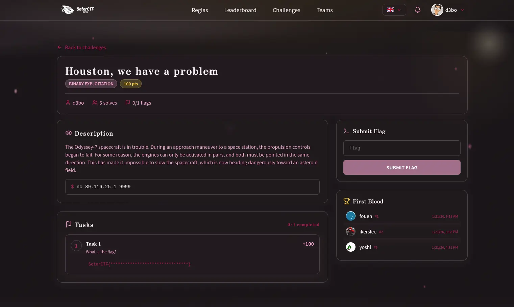
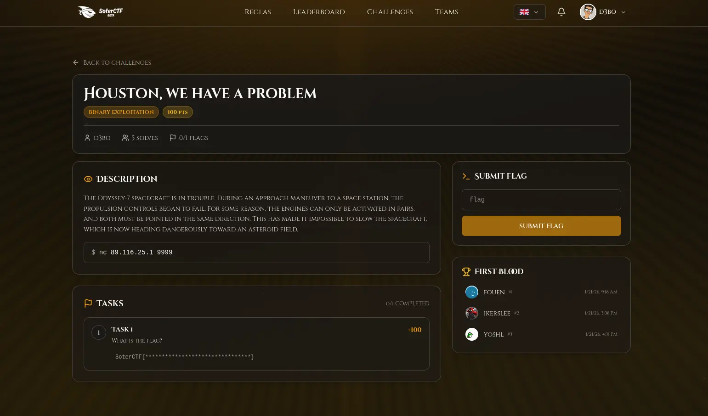
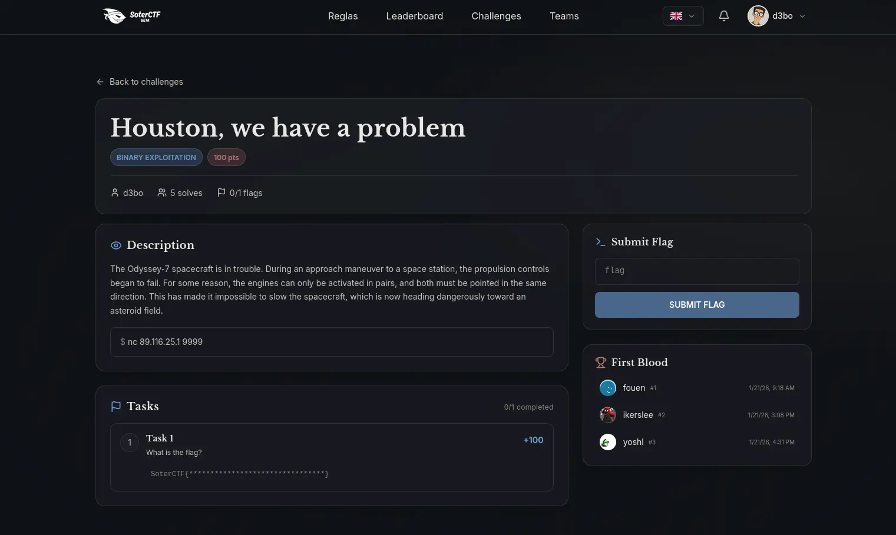
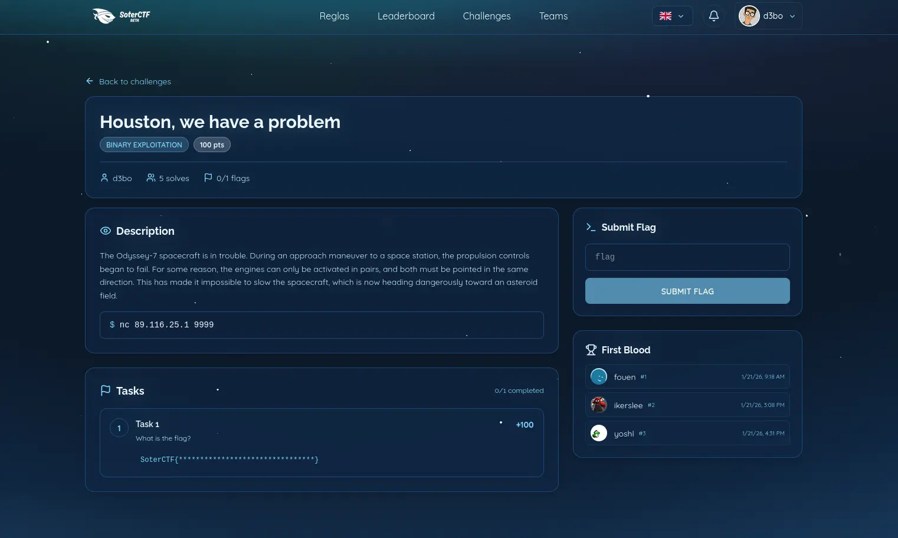
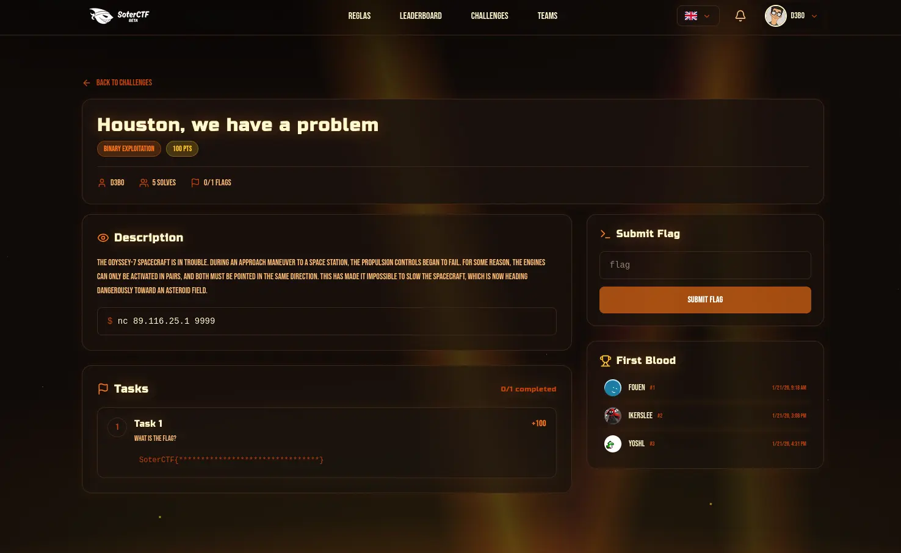
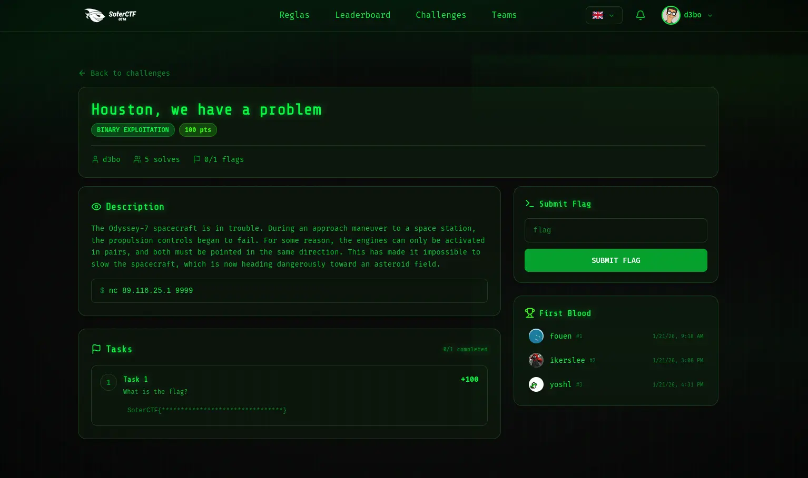



### Infra

We moved the infrastructure from Hostinger to Contabo because it was cheaper, and this time we did use Docker to simplify everything. Basically, there were four containers, all orchestrated from a `docker-compose.yml` file. Requests first went through Traefik; if the user accessed `docs.soterctf.com` was sent to the documentation container, and if accessed via any other domain or subdomain, it was sent to the website.

```yml
networks:
  proxy:
    name: proxy
    driver: bridge

services:
  traefik:
    image: traefik:latest
    container_name: traefik
    command:
      - --api.insecure=true
      - --providers.docker=true
      - --providers.docker.exposedbydefault=false
      - --entrypoints.web.address=:80
      - --log.level=DEBUG
    ports:
      - "80:80"
      - "127.0.0.1:8080:8080"
    volumes:
      - /var/run/docker.sock:/var/run/docker.sock:ro
    networks:
      - proxy
    restart: unless-stopped

  website:
    build: ../../repos/website
    container_name: website
    networks:
      - proxy
    labels:
      - "traefik.enable=true"
      - "traefik.docker.network=proxy"
      - 'traefik.http.routers.website.rule=Host(`soterctf.com`) || HostRegexp(`^.+\.soterctf\.com$`)'
      - "traefik.http.routers.website.entrypoints=web"
      - "traefik.http.routers.website.priority=10"
      - "traefik.http.services.website.loadbalancer.server.port=80"
    restart: unless-stopped

  api:
    build: ../../repos/api
    container_name: api
    networks:
      - proxy
    labels:
      - "traefik.enable=true"
      - "traefik.docker.network=proxy"
      - "traefik.http.routers.api.rule=Host(`api.soterctf.com`)"
      - "traefik.http.routers.api.entrypoints=web"
      - "traefik.http.routers.api.priority=100"
      - "traefik.http.services.api.loadbalancer.server.port=3000"
    restart: unless-stopped

  docs:
    build: ../../repos/docs
    container_name: docs
    networks:
      - proxy
    labels:
      - "traefik.enable=true"
      - "traefik.docker.network=proxy"
      - "traefik.http.routers.docs.rule=Host(`docs.soterctf.com`)"
      - "traefik.http.routers.docs.entrypoints=web"
      - "traefik.http.routers.docs.priority=100"
      - "traefik.http.services.docs.loadbalancer.server.port=80"
    restart: unless-stopped

  db:
    image: mysql:8.0
    container_name: db
    restart: unless-stopped
    environment:
      TZ: Europe/Madrid
    volumes:
      - db_data:/var/lib/mysql
    networks:
      - proxy
    ports:
      - "127.0.0.1:3306:3306"


volumes:
  db_data:
```

Another priority was that it be scalable, and we didn’t want the server to get cluttered with profile photos, team photos, and so on... So, for convenience, speed, and scalability, we decided to use Contabo Storage, which basically creates a bucket for storing files. The problem is that there are people with malicious intent who host their malware there, so Google often blocks the URLs of Contabo buckets. That’s why we decided to switch to Cloudflare buckets, which are also free!

When it came to email, we went with the easy option and chose Hostinger, since for just 5 euros a year you can get a decent email server that’s already set up and ready to use.


## First Competition (Pàlcam CyberGames)


With all this in mind, we decided to organize a competition in collaboration with our school, Pàlcam, and with the support of UNIR (International University of La Rioja). The competition was open to students from all over Spain.

We created 27 challenges between [kbaa](https://soterctf.com/app/profile/d1942409-ed6d-11f0-b0c3-9e960caee775), [yoshl](https://soterctf.com/app/profile/91002dc6 -dff9-11f0-9e02-4a52c5e88dba), [Carlitos19](https://soterctf.com/app/profile/7c48aaf7-14c5-11f1-a1fd-8ecdeefe4fa2), [ikerslee](https://soterctf.com/app/profile/4987d4ca-d6b6-11f0-9e02-4a52c5e88dba), [fouen](https://soterctf.com/app/profile/e733a482 -f5ee-11f0-b0c3-9e960caee775), [iHarzz](https://soterctf.com/app/profile/a6911c2f-fa2b-11f0-9295-aaa7660e6e7e), and me. The challenges covered the following topics:

- Reversing
- Web 
- Crypto
- Forensics
- Hardware Hacking
- Misc
- Game PWN

### Marketing

To promote the competition, I posted several updates on LinkedIn, both on my personal account and on Soter’s, which were quite effective in attracting users. The posts always included an attention grabbing opening to capture the user’s interest and encourage them to keep reading, in addition, all the posts featured images to make them even more eye-catching. 

Another method we used to encourage more people to join was to arrange with UNIR for a prize to be raffled off among those who had registered for the competition and solved at least one challenge. It often happens in competitions that people choose not to participate because they think they have no chance of winning, but this UNIR prize changed that, it encouraged people to sign up even if they didn’t expect to win, because they could still be in the running for the UNIR prize.

With all of this, we were able to reach a certain audience, but we wanted more, so we contacted ctftime to have our competition added to their calendar. We didn't succeed with our first competition, but we did with this one: [https://ctftime.org/event/3211/](https://ctftime.org/event/3211/)

Thanks to that, we reached 600 users on soterctf and 377 participants in the competition

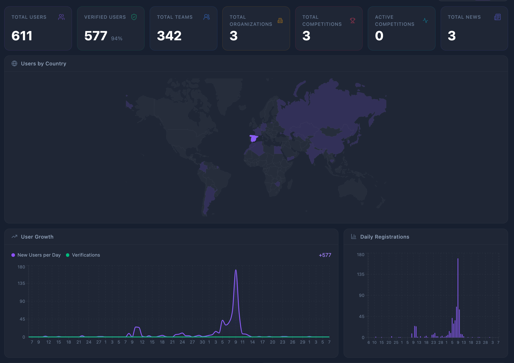

There was a problem: even though it clearly stated everywhere that the contest was for students in Spain, people from many different countries signed up. After giving it some thought, we decided to let them participate but without the chance to win a prize. We had users from:

- Spain
- Germany
- France
- China
- Morocco
- India 
- Colombia 
- Yemen 
- Bangladesh 
- Vietnam
- Argentina 
- Japan

Plus all the people that didn't specify their country


In addition to pre-event marketing, post-event marketing is also important. We wanted people to keep talking about the event even after it had ended, so we launched two initiatives. The first was to give participants certificates of participation, encouraging them to post photos of their certificates on LinkedIn.

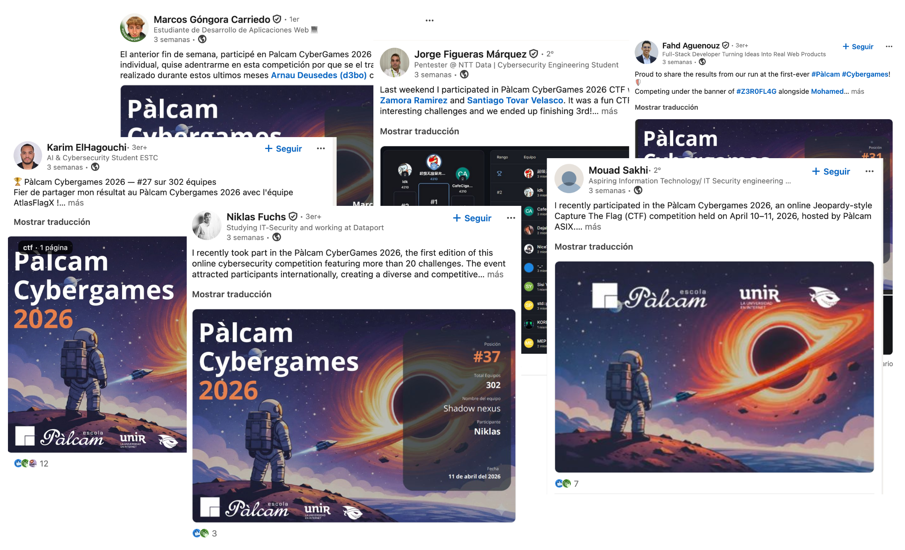

The second approach we took for post-competition marketing was to offer an additional prize for the best write-up (solution to a challenge). This encouraged people to post their solutions to the challenges on their websites, thereby increasing visibility for Soter. Here are some of the write-ups we received: 

```
https://kore.one/palcam-cybergames-2026-workshop-challenge-writeup/
https://kore.one/palcam-cybergames-2026-soter-engineering-team-challenge-writeup/
https://github.com/ShadowNexus1337/Palcam-CyberGames-2026/blob/main/02%20Challanges/10%20Ca%C3%AFssa/Writeup.md
https://github.com/ShadowNexus1337/Palcam-CyberGames-2026/blob/main/02%20Challanges/19%20R0ckstar!/Writeup.md
https://github.com/ShadowNexus1337/Palcam-CyberGames-2026/blob/main/02%20Challanges/08%20Bank/Writeup.md
https://github.com/ShadowNexus1337/Palcam-CyberGames-2026/blob/main/02%20Challanges/13%20Cosmos%20Strike/Writeup.md
https://github.com/ShadowNexus1337/Palcam-CyberGames-2026/blob/main/02%20Challanges/11%20Random%20Lunar%20Primes/Writeup.md
https://github.com/ShadowNexus1337/Palcam-CyberGames-2026/tree/main/02%20Challanges/14%20Concrete%20Frequency
https://github.com/ShadowNexus1337/Palcam-CyberGames-2026/tree/main/02%20Challanges/17%20The%20Space%20Man
https://github.com/ShadowNexus1337/Palcam-CyberGames-2026/blob/main/02%20Challanges/06%20Random%20Moon%20Base/Writeup.md
https://github.com/ShadowNexus1337/Palcam-CyberGames-2026/blob/main/02%20Challanges/15%20Events/Writeup.md
https://github.com/ShadowNexus1337/Palcam-CyberGames-2026/blob/main/02%20Challanges/07%20Whispers%20of%20the%20Old%20Castle/Writeup.md
https://github.com/ShadowNexus1337/Palcam-CyberGames-2026/blob/main/02%20Challanges/22%20Strange%20message/Writeup.md
https://github.com/ShadowNexus1337/Palcam-CyberGames-2026/blob/main/02%20Challanges/01%20Asteroid%20Pathfinder/Writeup.md
https://github.com/ShadowNexus1337/Palcam-CyberGames-2026/blob/main/02%20Challanges/02%20A%20lot%20of%20Squares/Writeup.md
https://github.com/ShadowNexus1337/Palcam-CyberGames-2026/blob/main/02%20Challanges/03%20A%20lot%20of%20Queens/Writeup.md
https://github.com/ShadowNexus1337/Palcam-CyberGames-2026/blob/main/02%20Challanges/05%20Twins/Writeup.md
https://github.com/ShadowNexus1337/Palcam-CyberGames-2026/blob/main/02%20Challanges/04%20Access%20denied/Writeup.md
https://github.com/ShadowNexus1337/Palcam-CyberGames-2026/blob/main/02%20Challanges/12%20Code%20Lost%20in%20Space/Writeup.md
https://github.com/ShadowNexus1337/Palcam-CyberGames-2026/blob/main/02%20Challanges/18%20Logic%20Gates%20II/Writeup.md
https://github.com/ShadowNexus1337/Palcam-CyberGames-2026/blob/main/02%20Challanges/20%20Logic%20Gates%20I/Writeup.md
https://github.com/ShadowNexus1337/Palcam-CyberGames-2026/blob/main/02%20Challanges/16%20Pentest%20Report/Writeup.md
https://github.com/ShadowNexus1337/Palcam-CyberGames-2026/blob/main/02%20Challanges/09%20Deep%20Fried%20Discovery/Writeup.md
https://github.com/ShadowNexus1337/Palcam-CyberGames-2026/blob/main/02%20Challanges/21%20Sanity%20check/Writeup.md
https://writeup-soterctf.carriedo.cat/#caissa
https://writeup-soterctf.carriedo.cat/#bank
https://writeup-soterctf.carriedo.cat/#cosmos-strike
https://writeup-soterctf.carriedo.cat/#random-lunar-primes
https://writeup-soterctf.carriedo.cat/#concrete-frequency
https://writeup-soterctf.carriedo.cat/#the-space-man
https://writeup-soterctf.carriedo.cat/#blue-crystal-crumbs
https://writeup-soterctf.carriedo.cat/#galactic-breach
https://writeup-soterctf.carriedo.cat/#random-moon-base
https://writeup-soterctf.carriedo.cat/#whispers-of-the-old-castle
https://writeup-soterctf.carriedo.cat/#strange-message
https://writeup-soterctf.carriedo.cat/#asteroid-pathfinder
https://writeup-soterctf.carriedo.cat/#a-lot-of-squares
https://writeup-soterctf.carriedo.cat/#a-lot-of-queens
https://writeup-soterctf.carriedo.cat/#twins
https://writeup-soterctf.carriedo.cat/#access-denied
https://writeup-soterctf.carriedo.cat/#pentest-report
https://writeup-soterctf.carriedo.cat/#deep-fried-discovery
https://writeup-soterctf.carriedo.cat/#sanity-check
https://kore.one/palcam-cybergames-2026-cosmos-strike-challenge-writeup/
https://writeup-soterctf.carriedo.cat/#soter-engineering-team
https://writeup-soterctf.carriedo.cat/#workshop
https://writeup-soterctf.carriedo.cat/#code-lost-in-space
https://writeup-soterctf.carriedo.cat/#r0ckstar
https://writeup-soterctf.carriedo.cat/#logic-gates-i
https://writeup-soterctf.carriedo.cat/#logic-gates-ii
https://kore.one/palcam-cybergames-2026-galactic-breach-challenge-writeup/
https://figueron.site/challenges/web/workshop/
https://kore.one/palcam-cybergames-2026-access-denied-challenge-writeup/
https://kore.one/palcam-cybergames-2026-events-challenge-writeup/
https://kore.one/soterctf-demo-competition-masa-challenge-writeup/
https://kore.one/soterctf-demo-competition-houston-we-have-a-problem-challenge-writeup/
```

## Conclusion

Web development isn't my strong suit, nor do I want it to be, but I've learned a lot of new things during this project and had a great time.

The Pàlcam CyberGames competition went much better than we expected and served as a fitting conclusion to the project.

I’d like to thank everyone who supported and participated in this project, because without them it wouldn’t have been possible:

- [ikerslee](https://www.linkedin.com/in/iker-corral-2949552a2/): 
- [fouen](https://www.linkedin.com/in/joelguillen06/)
- [yoshl](https://www.linkedin.com/in/jgm07/)
- [garcimarcus](https://www.linkedin.com/in/marc-garc%C3%ADa-cos-48a0b12bb/)
- [anfu](https://www.linkedin.com/in/marc-peric%C3%A0s-8336ba180/)
- [kbaa](https://www.linkedin.com/in/biel-rosales/)
- [iHarzzi](https://www.linkedin.com/in/david-poderoso-712407267/)
- [carlos](https://www.linkedin.com/in/carlos-ortiz-arjona-91a0192bb/)
- [mojopug](https://www.linkedin.com/in/moiseshermo/)
